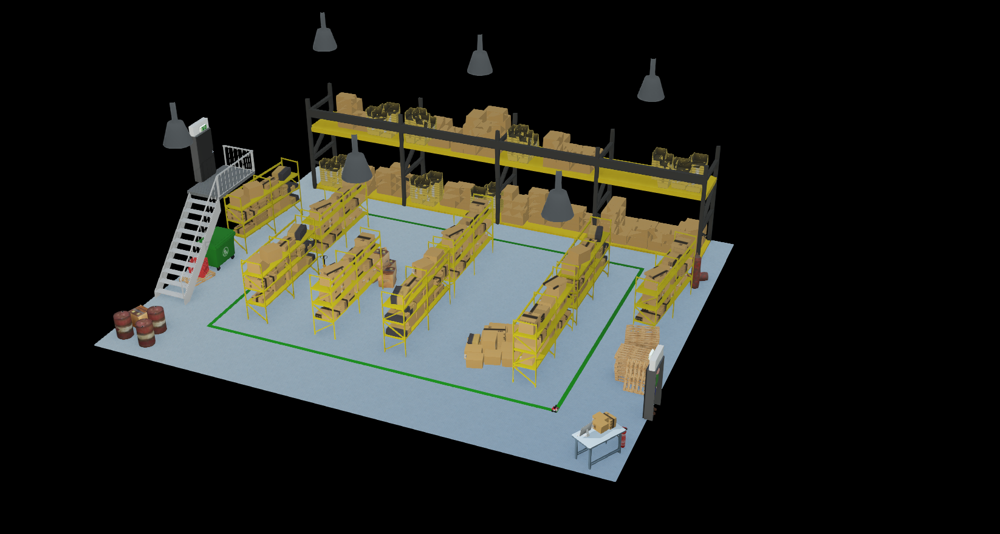
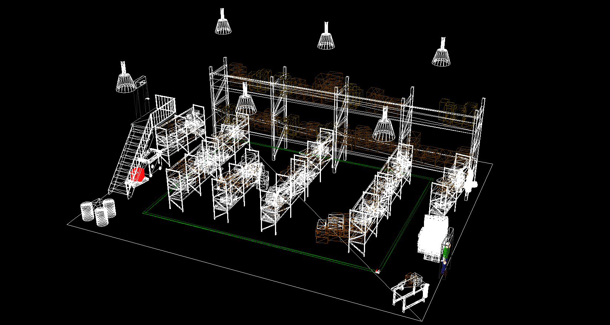

  
  
  <h1>Cartograph Automata</h1>
  
By Rokawoo, Khoi, Arya, Mehroj

> [!CAUTION]
> :star: Our Codefest Project is really Based!

## Abstract

Current AMR navigation relies heavily on basic sensor systems like LIDAR and ultrasonic sensors, which simply detect obstacles and follow predetermined rules without true environmental understanding. Cartograph Automata bridges this gap by creating a hybrid system where computer vision not only detects obstacles but intelligently interprets the environment to make contextual decisions. 

By translating visual data into movement commands, our model enables robots to safely navigate around obstacles and people in real-time, even when encountering previously unseen scenarios. This proof-of-concept demonstrates how CV-enhanced navigation significantly improves safety and efficiency in both warehouse, public settings, and applications beyond, allowing AMRs to dynamically adapt to changing conditions while maintaining operational objectives.

The system's ability to decide when to deviate from programmed paths and when to return to them represents a meaningful step toward more autonomous and adaptable robotic systems for industrial and service applications.

## Demo

[Demo Video](#)

## Project Media

  
  
  
  

## Obejct Detection

  
  
  
  

## Image Segmentation

  
  

# **Training Loss Graphs**
We visualize various loss metrics during the training process to track model performance and convergence. Below are the key loss functions plotted:

| Loss Type               | Description |
|-------------------------|-------------|
| **Classification Loss** | Measures how well the model classifies objects, typically using Cross-Entropy Loss. |
| **Localization Loss**   | Penalizes incorrect bounding box predictions, often using Smooth L1 or IoU Loss. |
| **Regularization Loss** | Helps prevent overfitting by adding constraints (e.g., L2 weight decay). |
| **Total Loss**         | Sum of all losses, representing overall optimization progress. |
| **Learning Rate**       | Tracks how the learning rate changes over training steps. |

## **Loss Graph**
Below is a consolidated graph displaying all loss metrics over training steps:

  
  
  
  
  
  

## :mag: Key Features

- **Intelligent Path Deviation**: Makes contextual decisions about when to leave programmed paths
- **Obstacle Classification**: Distinguishes between static obstacles, humans, and other mobile objects
- **Return-to-Path Algorithm**: Efficiently returns to optimal routes after obstacle avoidance
- **Simulation Validated**: Tested in various Webots environments including warehouses and public spaces
- **Hybrid Sensing Integration**: Combines traditional sensors with computer vision for robust navigation

## 🛠️ Libraries and Tools Used

- **TensorFlow Model Zoo**: For fine-tuning the SSD ResNet50 V1 FPN 640x640 (RetinaNet50) model
- **Webots**: Professional robot simulator for testing and validation
- **Python**: Primary programming language
- **OpenCV**: For additional image processing
